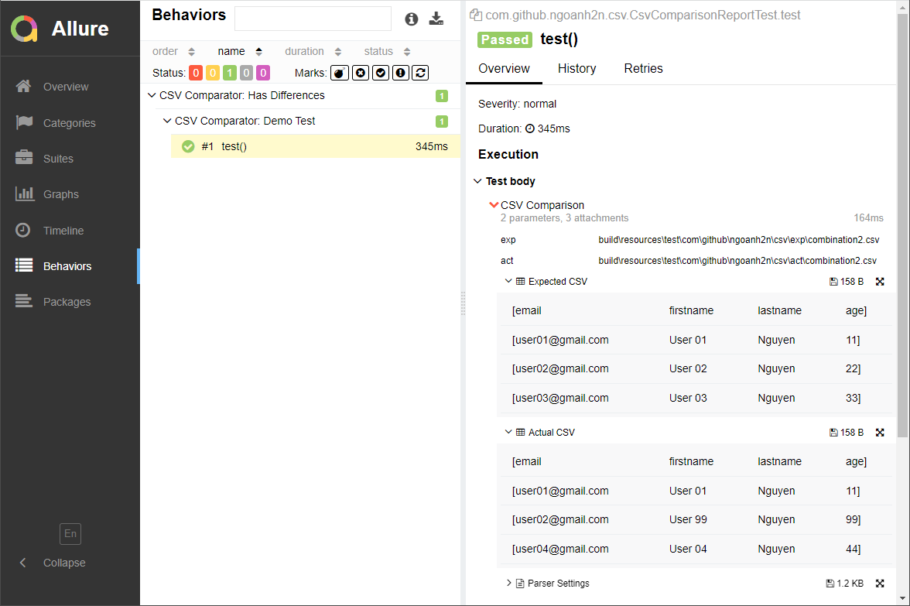

[](https://maven-badges.herokuapp.com/maven-central/com.github.ngoanh2n/csv-comparator-allure)
[](https://javadoc.io/doc/com.github.ngoanh2n/csv-comparator-allure)
[](http://www.oracle.com/technetwork/java/javase/downloads/index.html)
[](https://opensource.org/licenses/MIT)

# CSV Comparator for Allure
**Table of Contents**
<!-- TOC -->
* [Declaration](#declaration)
  * [Gradle](#gradle)
  * [Maven](#maven)
* [System Property](#system-property)
<!-- TOC -->
When using Allure as a report framework, `csv-comparator-allure` should be used.



# Declaration
## Gradle
Add to `build.gradle`.
```gradle
implementation("com.github.ngoanh2n:csv-comparator-allure:1.6.0")
```

## Maven
Add to `pom.xml`.
```xml
<dependency>
    <groupId>com.github.ngoanh2n</groupId>
    <artifactId>csv-comparator-allure</artifactId>
    <version>1.6.0</version>
</dependency>
```

# System Property
| Name                            | Description                                                   | Default  |
|:--------------------------------|:--------------------------------------------------------------|:---------|
| `ngoanh2n.csv.includeSource`    | Indicate which attaches CSV sources to Allure report.         | `true`   |
| `ngoanh2n.csv.includeSettings`  | Indicate which attaches CSV parser settings to Allure report. | `true`   |
